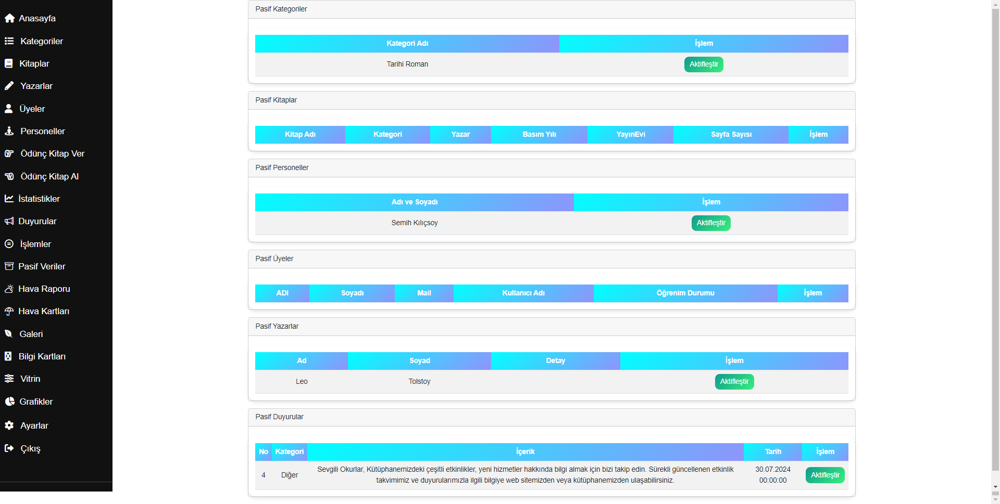

# LIBRARYWORLD
Hello,

I recently completed a library project, and I'd like to share it. While working on this project, I learned and applied many new concepts and techniques. Throughout the development process, I incorporated the following features:

Layout Control
Controller Structure
Model Structure
View Structure
LINQ Queries
Entity Framework Queries
Related Tables
Diagrams
Trigger Usage
Stored Procedure Creation
Setup and Customization of Pre-built Templates
CSS Controls
Bootstrap Integration
Dynamic Web Project Development
Dashboard Structure
Charts and Widget Cards Implementation
Working on this project allowed me to enhance my technical knowledge and experience a more efficient software development process.

Admin Panel Login: /AdminLogin/Login/
Admin mail: Aytuuc1@gmail.com
Admin Password:852123456

